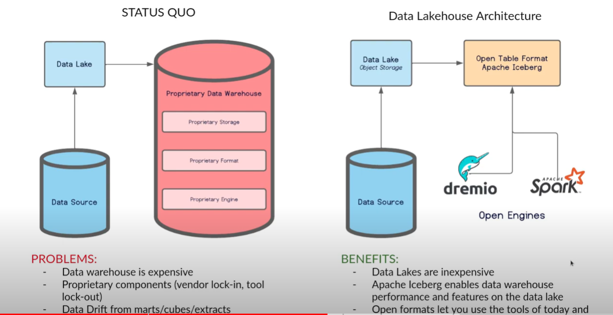

# Iceberg Integration With Data lake Using Java

### Traditional vs Iceberg powered

### Purpose of Iceberg in analytics

Iceberg gives flexibility to run analytical queries very 
faster using Table Formats. With Iceberg, we can completely run complex analytical, reporting queries
without data warehouse. With Iceberg, our data lake can become data lake house. 

Refer below link for more details on iceberg.

https://www.youtube.com/playlist?list=PL-gIUf9e9CCtGr_zYdWieJhiqBG_5qSPa

As part of this project, I have tried to integrate Iceberg in local machine. Flow contains 
below modules.

1. Query Engine - I have used spark standalone, we can use hive, flink, presto etc.
2. Catalog Server - Used Postgres DB in local, we can use Project Nessie, Any custom rest service, any JDBC supported
                    database
3. Data Lake - Hadoop File system installed on local machine, can be any Object storage like S3
4. Iceberg Libraries - Used Java based

## Tasks:

1.  Create Catalog in Catalog Server for Iceberg
2.  Publish Table Schema For Catalog
3.  Using Spark Engine, Iceberg - Spark libraries, load the data according Table schema
4.  Verify metadata files creation by Iceberg to locate actual data files in Hadoop File System
5.  Read the data files using Iceberg libraries

### Files:
1. CatalogPublish.java - to publish Iceberg catalog
2. PushRecordsWithIcebergSpark.java
3. LoadRecordsWithIcebergSpark.java